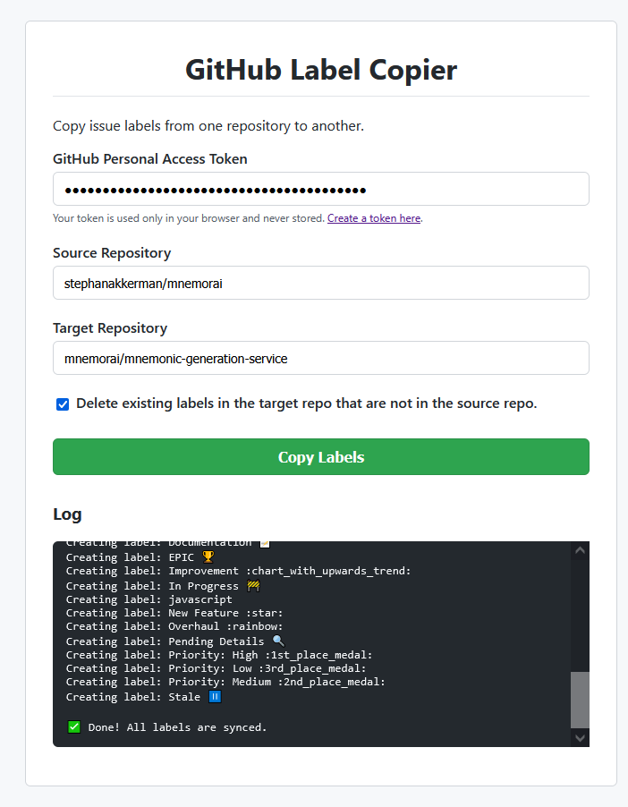

# GitHub Label Copier 🏷️

 <!-- TODO: Replace with your live URL -->

Tired of manually recreating your finely-tuned GitHub labels for every new repository? The **GitHub Label Copier** is a simple, powerful web tool that lets you copy labels from one repository to another in seconds.

No installs, no command line, no fuss. Just a clean interface to get the job done quickly.

## ✨ Features

*   **Zero Installation:** Runs entirely in your browser. Nothing to download or install.
*   **Perfect Sync:** Copies the label name, color, and description exactly.
*   **Update or Create:** Intelligently updates existing labels and creates new ones.
*   **Optional Cleanup:** Choose to delete labels from the target repository that don't exist in the source.
*   **Fast and Efficient:** Uses the official GitHub API for quick and reliable syncing.
*   **Secure:** Your GitHub token is only used in your browser to make API requests and is never stored.
*   **Free to Use & Host:** Deployed on GitHub Pages, making it free for everyone.

---

## 🚀 Try It Live!

The tool is hosted on GitHub Pages and is ready to use right now:

**[https://akkerman.ai/github-label-copier/](https://akkerman.ai/github-label-copier/)**

---

## 📋 How to Use

Using the tool is a simple four-step process:

1.  **Generate a GitHub Token:**
    *   The tool needs permission to read and write labels on your behalf. You can provide this by creating a **Personal Access Token (PAT)**.
    *   **[Click here to generate a new token](https://github.com/settings/tokens/new?scopes=repo&description=GitHub%20Label%20Copier)**.
    *   The link pre-selects the required `repo` scope. Just scroll down and click **"Generate token"**.
    *   **Copy the token immediately!** You won't be able to see it again.

2.  **Fill in the Repositories:**
    *   **Source Repository:** The repo you want to copy labels *from* (e.g., `facebook/react`).
    *   **Target Repository:** The repo you want to copy labels *to* (e.g., `YourUsername/my-awesome-project`).

3.  **Choose Your Options:**
    *   Check the "Delete existing labels..." box if you want to make the target repository's labels an exact mirror of the source.

4.  **Copy!**
    *   Click the "Copy Labels" button and watch the log for real-time progress.

---

## 🔒 A Note on Security

Your security is paramount. Here’s how your token is handled:

*   Your Personal Access Token is stored **only in your browser's memory** while you have the page open.
*   It is sent **directly to the GitHub API** over a secure HTTPS connection and is never sent to or stored on any other server.
*   For maximum security, **we strongly recommend you delete the token** from your [GitHub tokens page](https://github.com/settings/tokens) after you are finished using the tool.

---

## 🛠️ How It Works

This project is a pure static web application built with:

*   **HTML:** For the structure and content.
*   **CSS:** For clean, modern styling.
*   **JavaScript (ES6+):** For all the logic, including `async/await` and the `fetch` API to communicate directly with the [GitHub REST API](https://docs.github.com/en/rest).

Because it's a static site, it can be hosted for free and with great performance on **GitHub Pages**.

## 🤝 Contributing

Contributions are welcome! If you have an idea for a new feature, find a bug, or want to improve the code, feel free to:

1.  **Fork** the repository.
2.  Create your feature branch (`git checkout -b feature/AmazingFeature`).
3.  Commit your changes (`git commit -m 'Add some AmazingFeature'`).
4.  Push to the branch (`git push origin feature/AmazingFeature`).
5.  Open a **Pull Request**.

You can also open an issue with the "bug" or "enhancement" tag.

## 📄 License

This project is licensed under the MIT License. See the [LICENSE](LICENSE.md) file for details.